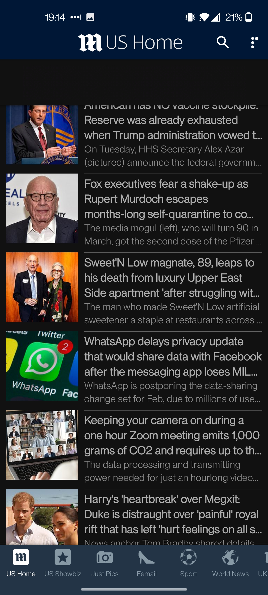

# DGL 114 Process Portfolio

## By Amanda Thompson

### Week 1

**ACTIVITY 0101**:

**The 'Good'**:

An app whose interface that I consider 'good' is Spotify. I've been using the service for years and it's always been easy to navigate. The interface is well laid out on every page. On the main pages, they include large navigation buttons on the bottom for home, search, and your library and a settings toggle in the top right corner. It has good contrast with the text and background so everything is very readable. All of the pages establish a well laid out hierarchy by catching your eye either at the top left with a large heading or in the center with an album cover. Your eyes naturally follow the page down to the rest of the information. The app primarily has a single column layout unless the page is filled with large buttons or albums, in which case, it will have a two column layout.

A negative I could write about Spotify is that it can be hard for a user to find the song queue. In my experience, when a Spotify account is used and shared at work, employees will add songs, playlists, or albums to the queue. It's not outright apparent that an album or playlist was added to a queue from another employees perspective so if they want to play something else, the playlist jumps back to the queue right after the different song was played. This is when you realize the issue and have a hard time finding the queue to remove the other songs. It's only in the currently playing page at the bottom right below the stop/skip/play bar. It's not apparent what the icon is either; three parallel lines with a tiny play symbol on the top line.

 
 

**The 'Poor'**:

The app I've chosen to write about for the 'poor' interface is Daily Mail Online. The general interface of the app is tightly packed together with a lot of ads but there are display settings that allow you to change the colour theme, line spacing, and article text size to adjust to optimize readability. Dark mode has off-white text that's easy on the eyes and makes the tightly packed layout not so harsh to look at while reading the articles.

There are a lot of ads in this app. There's ads in the headers, article lists, articles, and full page ads while scrolling through the article images. There's image ads and loudly coloured, animated ads, and full page ads in the middle of the articles with a whole ton of sponsored ads at the end of the article.

The navigation bar scrolls revealing many (22!) options for different categories of news to view.

 
 
________________________________________________________________________________________________________________________

 
 
**ACTIVITY 0102**:

Some of the things that I find 'usable' and intuitive in an app are:

- Simplicity
- Efficiency
- Long pressing a button brings up options or enabling multiple items to be chosen
- Swiping left or right in email inbox to delete or archive email
- The FAB for creating an email, post, playlist, etc.
- Options to add gifs, images, location, etc to social media posts or messages.
- Live word count if a post has a maximum character limit.
- Being able to view post activity like how many people have seen it, total engagements, etc.
- The keyboard popping up when you click on a text box.
- Being able to reply to someone and have it automatically tag a user.
- Editing your posts and comments
- Offering to translate comments and posts into your default language
- When on an instagram profile or in the search page, it allows you to press and hold an image and it will enlarge the image to view it better
- Double tap to like images or comments
- On buy and sell or marketplace posts, having the message button visible on the post to contact the seller with one tap
- The coveted dark mode.
- Allowing users to search near their location
