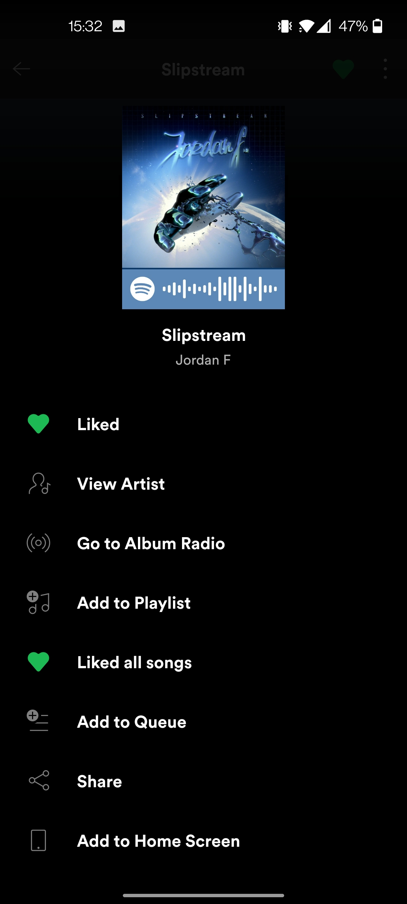
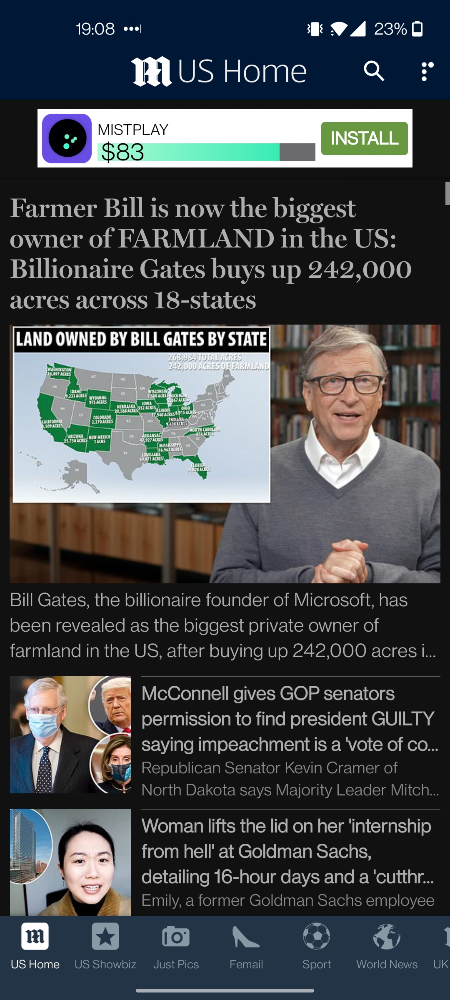

# DGL 114 Process Portfolio

## By Amanda Thompson

### Week 1

**ACTIVITY 0101**:

**The 'Good'**:

An app whose interface that I consider 'good' is Spotify. I've been using the service for years and it's always been easy to navigate. The interface is well laid out on every page. On the main pages, they include large navigation buttons on the bottom for home, search, and your library and a settings toggle in the top right corner. It has good contrast with the text and background so everything is very readable. All of the pages establish a well laid out hierarchy by catching your eye either at the top left with a large heading or in the center with an album cover. Your eyes naturally follow the page down to the rest of the information. The app primarily has a single column layout unless the page is filled with large buttons or albums, in which case, it will have a two column layout.

A negative I could write about Spotify is that it can be hard for a user to find the song queue. In my experience, when a Spotify account is used and shared at work, employees will add songs, playlists, or albums to the queue. It's not outright apparent that an album or playlist was added to a queue from another employees perspective so if they want to play something else, the playlist jumps back to the queue right after the different song was played. This is when you realize the issue and have a hard time finding the queue to remove the other songs. It's only in the currently playing page at the bottom right below the stop/skip/play bar. It's not apparent what the icon is either; three parallel lines with a tiny play symbol on the top line.

 
 

**The 'Poor'**:

The app I've chosen to write about for the 'poor' interface is Daily Mail Online. The general interface of the app is tightly packed together with a lot of ads but there are display settings that allow you to change the colour theme, line spacing, and article text size to adjust to optimize readability. Dark mode has off-white text that's easy on the eyes and makes the tightly packed layout not so harsh to look at while reading the articles.

There are a lot of ads in this app. There's ads in the headers, article lists, articles, and full page ads while scrolling through the article images. There's image ads and loudly coloured, animated ads, and full page ads in the middle of the articles with a whole ton of sponsored ads at the end of the article.

The navigation bar scrolls revealing many (22!) options for different categories of news to view.

 
 

________________________________________________________________________________________________________________________

 
 

**ACTIVITY 0102**:

Some of the things that I find 'usable' and intuitive in an app are:

- Simplicity
- Efficiency
- Long pressing a button brings up options or enabling multiple items to be chosen
- Swiping left or right in email inbox to delete or archive email
- The FAB for creating an email, post, playlist, etc.
- Options to add gifs, images, location, etc to social media posts or messages.
- Live word count if a post has a maximum character limit.
- Being able to view post activity like how many people have seen it, total engagements, etc.
- The keyboard popping up when you click on a text box.
- Being able to reply to someone and have it automatically tag a user.
- Editing your posts and comments
- Offering to translate comments and posts into your default language
- When on an instagram profile or in the search page, it allows you to press and hold an image and it will enlarge the image to view it better
- Double tap to like images or comments
- On buy and sell or marketplace posts, having the message button visible on the post to contact the seller with one tap
- The coveted dark mode.
- Allowing users to search near their location

 
 

________________________________________________________________________________________________________________________

 
 

### Week 2

**ACTIVITY 0201**

Features and permissions of Instagram:

**Permissions**:

#### Allowed: 
- Camera - Only when in use
- Contacts
- Files and media - All files
- Location - Only when in use
- Microphone - Only when in use

#### Denied:
- Phone

**Features**:

- Microphone
- Camera
- Location
- Portrait
- Touch screen + multitouch
- Wifi
- Session Initiation Protocol
- Web view
- Input methods
- Managed Users
- Securely Removes Users

 
 

________________________________________________________________________________________________________________________

 
 

**ACTIVITY 0202**:

**Identifying elements of the MVC pattern in Twitter feed:**

#### Model:

- Stories FAB and user icons contain profile image data
- Tweets contain image data, link address, profile name, time posted, tweet text, number of likes, number of retweets, number of comments.
- Top navigation bar contains favicon data, top-of-page data, settings data.
- Bottom navigation bar contains home page data, search page data, notification page data, message data.

#### Controller:

- Stories FAB allows user to post image story.
- Comment button in tweets allow user to add comments - updates how many comments with live counter.
- Retweet button allows user to repost a tweet - updates how many retweets with live counter.
- Like button allows user to add a like to a tweet - updates how many likes with live counter.
- Post FAB allows user to make a new post.
- Personal tweets contain button to allow you to see the metadata of your tweet with live updates.
- Share button allows user to share tweet to other apps.

#### View:

- Top navigation bar contains favicon, top-of-page icon, settings icon.
- Stories bar contains profile images.
- New content button informs of new posts and brings you back to top of the page.
- Tweets contain profile image, time posted, comment icon, retweet icon, like icon, share icon, options icon, users text, images, or shows link previews.
- Bottom navigation bar contains home page icon, search page icon, notifications icon, messages icon.
- Background colour.
- FAB tween icon.

 
 

________________________________________________________________________________________________________________________

 
 

### Week 3

**Activity 0301**:

I'm going to use Instagram to identify all the activities used in the app.

***Activities***:

* Home screen

    * Stories
        * Create new
        * Camera settings
        * See who's viewed your story
        * Story settings

    * New post screen
        * Edit post
        * Filters
        * Captions/tag screen

    * Messages
        * Chats
        * Camera
        * Video chat
        * New message
        * Search for user to message
    
    * Search screen 
        * QR code scanner
        
    * Reels screen
        * Watch Reels
        * Comments
        * Likes
        * Create Reels post
        * Choose video from library

    * Shop screen
        * Search screen
        * Wishlist
        * Product page
        * See more from seller
        * See all page

    * Profile page
        * Posts
        * Post comments
        * Likes
        * Edit profile
        * Choose new profile picture from gallery or new from camera
        * Stories
        * Followers
        * Following
        * Create new post
        * Settings
            * Archive
            * Highlights
            * Calendar
            * Location
            * Create highlight
            * Settings
            * Your activity
            * Time on Instagram
            * Notifications
                * Posts, stories, and comments
                * Following and followers
                * Messages
                * Live and IGTV
                * From Instagram
                * Email and SMS
            * Saved posts
            * Close friends
            * Discover people
            * Follow and invite friends
            * Privacy
                * Comments
                    * Block comments from
                * Tags
                    * Manually approve tags
                    * Pending tags
                * Mentions
                * Story
                    * Hide story from
                * Guides
                * Activity status
                * Messages
                    * Your followers on IG
                    * Friends or people you've chatted with
                    * Friends of friends
                    * People with your phone number
                    * Others on Facebook
                    * Others on IG
                    * Who can add you to groups
                    * Who can message you opens web view
                * Restricted accounts
                * Blocked accounts
                * Muted accounts
                * Accounts you follow
            * Security
                * Password
                * Login activity
                * Saved login info
                * Two-factor authentication
                * Emails from IG
                * Access data
                * Download data
                * Apps and websites
                * Search history
            * Ads
                * Ad preference
                * Ad topics
                * Data about your activity from partners
                * Ad activity
                * About ads
            * Account
                * Personal info
                * Your activity
                * Saved
                * Close friends
                * Language
                * Captions
                * Browser settings
                * Contacts syncing
                * Sharing to other apps
                * Cell data use
                * Original posts
                * Request verification
                * Posts you've liked 
                * Branded content tools
                * Switch to personal/business account
                * Add new professional account
            * Help
                * Report a problem
                * Help center
                * Support requests
                * Privacy and security help
            * About
                * Data policy
                * Terms of use
                * Open source libraries
            * Theme
            * Accounts center

 
 

***

 
 

**Activity 0302**:

Some common Android event types in Instagram are:

* onLongClick - An instance of this are: 
    * Long pressing an image in the search screen enlarges the post to a viewable size.
    * Long press on story bubbles brings up modal options to view profile or mute user.
    * Long pressing on messages brings up options menu with delete or mute options.
    * Long press in stories to pause videos.

* onTouch - A few instances of this are:
    * Swiping left or right will open the post creation tool or messages.
    * Swiping up and down will scroll the page accordingly.
    
* onDoubleTap 
    * Double tap to "like" posts or comemnts.
    * Double tap the screen when in camera mode to flip the camera - main or selfie.

 
 

***

 
 

### Week 4

**Activity 0401**:

The app I'm going to examine is Wealthsimple. The navigational model is hierarchical starting with the main portfolio home page.

* Main portfolio
    * Stock pages
        * Buy/Sell
        * Category likenesses
    * Available to trade - deposit
    * Learn more page
    * Earn cash and invite friends page
    * Search page
        * Top stocks
        * Featured
        * Categories
    * Account details
        * Account activity
        * Funding
            * Add funds
            * Transfer funds
            * Withdraw
            * Transfer an account
            * Transfer from Wealthsimple invest
            * Manage bank accounts
        * Explore Wealthsimple

    

 
 

***

 
 

**Activity 0402**:

The app that I'm going to examine to characterize all possible uses of implicit intents is Twitter.

* ACTION_EDIT
    * Writing a tweet
    * Editing profile
    * Editing Fleet posts
* ACTION_GET_CONTENT
    * Expanding details of tweets
    * Clicking on media content
    * Adding media to tweet from camera roll
    * Bringing up camera roll in Fleet
* ACTION_SEND
    * Sharing tweets
        * Bookmark
        * Direct message
        * Share in Fleet
        * Text message
        * Copy link
        * Share via
            * Copy
            * Nearby
            * Instagram direct messages
            * Facebook news feed
            * FB messenger
            * Twitter direct message
            * Bluetooth, Save to Google Drive, Discord, Add to Dropbox, Fleet, Tweet, Imgur Chat, Post on Reddit, Open in LastPass, LinkedIn private message, LinkedIn share in post, OneNote, Notes, Snapchat, Canon Print, Strava
        * Gmail
        * Slack
* ACTION_SEARCH
    * Search page
* ACTION_LONG_PRESS
    * Long press on search bar prompts copy and paste pop up
    * Long press on Fleet brings up mute or view profile menu
    * Long press on chat message brings up options menu
    * Long press on chat message brings up copy text or delete menu
* ACTION_SENDTO
    * Send private messages
    * Send tweets 
    * Send likes
* ACTION_VIEW
    * View post tweet 
    * View how many people liked tweet
    * View how many retweets
    * View comments
    * View new screen
* CATEGORY_ACCESSIBILITY_SHORTCUT_TARGET
    * Accessibility functions

 
 

***

 
 

### Week 5

**Activity 0501**:

The app I've chosen to draw a navigational diagram of is Wealthsimple.

